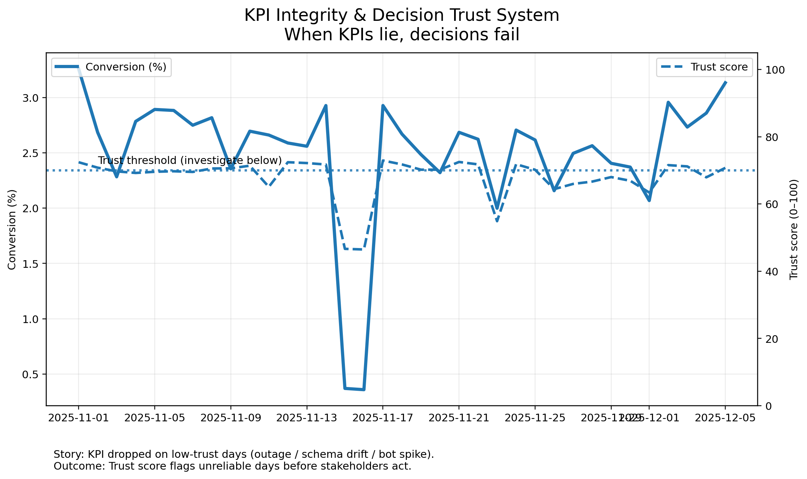

# KPI Integrity & Decision Trust System
When a KPI drops, teams often react instantly — cut spend, roll back releases, panic in Slack.

This project answers a calmer (and more useful) question:

> **Can we trust the KPI before we act on it?**

Instead of assuming clean data, I simulate realistic telemetry failures (tracking outages, schema drift, bot spikes, duplicates) and build a simple **KPI Trust Score (0–100)** so stakeholders know when a metric move is *signal* versus *measurement noise*.

---

## What this produces
After one command, the project generates:

- **Storytelling visuals**
  - `outputs/figures/kpi_vs_trust.png` — conversion movement + trust overlay
  - `outputs/figures/quality_heatmap.png` — root-cause map (which dimension broke)
  - `outputs/figures/decision_impact.png` — “reported vs corrected” decision impact

- **A stakeholder-ready decision memo**
  - `outputs/reports/decision_memo.md`

- **A LinkedIn/GitHub cover image**
  - `assets/cover.png`

---

## Why this is different from typical portfolio projects
Most portfolio dashboards assume the data is correct.

Real organisations don’t get that luxury.

This project shows how I approach:
- unreliable instrumentation
- changing event schemas
- traffic anomalies
- duplicate ingestion
- and the **decision risk** created by broken KPIs

---

## Quickstart (Windows / Mac / Linux)
Create a virtual environment and run the pipeline:

### Windows (PowerShell)
```powershell
python -m venv .venv
.venv\Scripts\activate
pip install -r requirements.txt
python run_all.py
